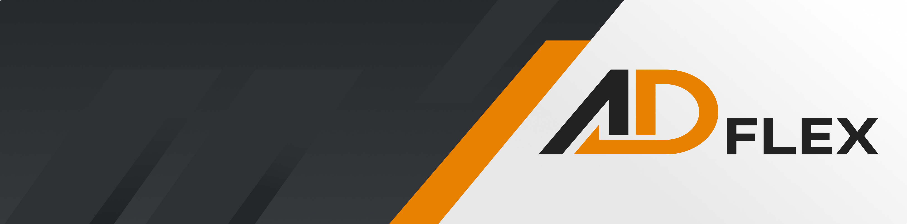

<br></br>


<br></br>

<h1 style="color:#f9f9f9;">💻 Sobre o projeto</h1>

<p  style="color:#f9f9f9;font-size:16px;">
🎨🖨️ AD-Flex - Uma aplicação para desktop voltada para a geração de notas de serviços na área da flexografia. Com ela
você pode cadastrar seus clientes e gerar suas notas de maneira ordenada rápida e eliminar toda a bagunças gerada por blocos e notas.
</p>

<br></br>

<h1 style="color:#f9f9f9;">🌐  Tecnologias</h1>

<p style="color:#f9f9f9; font-size:16px;">
As seguintes ferramentas foram usadas na construção do projeto:
</p>

<ul>
    <li><a href="https://developer.mozilla.org/pt-BR/docs/Learn/Getting_started_with_the_web/HTML_basics">HTML</a></li>
    <li><a href="https://developer.mozilla.org/pt-BR/docs/Web/CSS">CSS</a></li>
    <li><a href="https://developer.mozilla.org/pt-BR/docs/Learn/JavaScript">Javascript</a></li>
    <li><a href="https://www.electronjs.org/pt//">Electron js</a></li>
    <li><a href="https://nodejs.org/en">Node js</a></li>
    <li><a href="https://www.sqlite.org/index.html">Sqlite 3</a></li>
    <li><a href="https://expressjs.com/pt-br/">ExpressJS</a></li>
    <li><a href="https://www.mailgun.com/">Mailgun</a></li>

</ul>

<br></br>

<h1 style="color:#f9f9f9;">🚀 Como executar o projeto</h1>

<br></br>

<h2 style="color:#f9f9f9;"> Pré-requisistos</h2>

<p style="color:#f9f9f9; font-size:16px;"> 
É necessário utilizar um editor de código do seu gosto para rodar o projeto, mas recomendo o vs code onde o projeto foi construído.
</p>

<h2 style="color:#f9f9f9;"> 🧭 Rodando a aplicação em ambiente de desenvolvimento</h2>

```bash

# Clone do repositório

$ git clone https://github.com/Feehh32/adflex.git

# na pasta raiz do projeto no seu terminal (ou no terminal integrado do seu vs code) instale as dependencias do projeto

$ npm install

# para rodar a aplicação digite

$ npm start

# e para empacotar o projeto e gerar o instalador

$ npm run build

# o instalador estará dentro da pasta build que foi criada após o comando acima ser excutado

```

<br></br>

<h2 style="color:#f9f9f9;"> 📥 Baixando a aplicação</h2>

<br></br>

Você pode baixar a aplicação [aqui](https://drive.google.com/file/d/1IkrEUsbxb7yNo2B77LgdreW31w1DOo0-/view?usp=sharing).

<br></br>

<h1 style="color:#f9f9f9;">📝 Licença </h1>

<br></br>

<p style="color:#f9f9f9; font-size:16px;">

Este projeto é licenciado sob a Licença MIT - veja o arquivo [LICENSE](LICENSE) para detalhes.

</p>

<p style="color:#f9f9f9; font-size:16px">
Feito com ❤️ por Fernando Pereira <a href="https://www.linkedin.com/in/fernando-pereira-710448247/">👋🏽 Entre em contato!</a>
</p>
